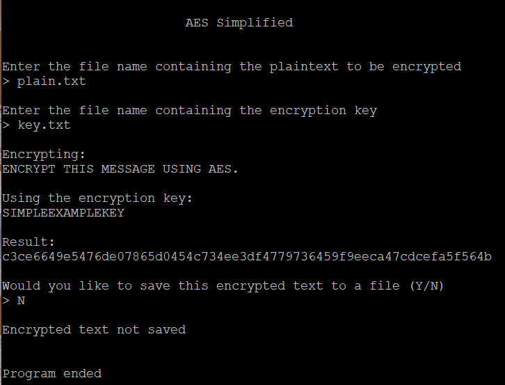

## AES Simplified

Encryption script based on a simplified version of the Advanced Encryption System (AES), implemented using python3.

## Table of Contents

1. [Description](#description)
2. [Program Output](#output)
3. [Execution](#exe)
4. [Function Headers](#function)
5. [Resources](#resources)

## Description <a name="description"></a>

AES Simplified start by asking the user for the filenames that contain the plaintext to be encrypted and the encryption key.
The resulting encrypted text will be outputted and the user will have the option to save the encrypted text to a file.

**NOTE:**

When executing, ensure the files containing the plaintext and the encryption key are in the same directory.


Plaintext encryption uses various methods implemented by AES such as:

- Polyalphabetic Substitution via the Encryption Key

	A Vigenere table is used to encrypt the plaintext

- Padding

	Further encryption is done on 4x4 character blocks therefore, the character A is used for padding so that the length of the message is divisible by 16

- Row Shifts

	Shifting of the four rows are done in the following fashion: row one is unshifted, row two is shifted one position, row three is shifted two positions, and row four is shifted three positions. All shifts are done to the left

- Parity Bits

	Each character's binary representation will have either an even amount of 1s or an odd amount of 1s. If it is odd then its most significant bit set to 1, if it is even then no changes will occur

- Mix Columns

	This step diffuses the data by transformation. The transformation is performed by multiplying the circulant MDS matrix with each column of the blocks of characters

## Program Output <a name="output"></a>



## Execution <a name="exe"></a>

To execute run the command `python3 main.py`

## Function Headers <a name="function"></a>

``` python
get_files()
```

- Description:

	Receives filenames from user

- Parameters:

	None

- Return:

	`input_file` String representing the name of the file that contains the plaintext to be encrypted

	`key_file` String representing the name of the file that contains the encryption key

	`output_file` String representing the name of the file that the cyphertext will be written to

---

``` python
get_text(input_file, key_file)
```

- Description:

	Reads in all contents of the input file and key file

- Parameters:

	`input_file` String representing filename containing plaintext

	`key_file` String representing filename containing encryption key

- Return:

	`message` List containing all text from the input file

	`key` String containing encryption key from the key file

---

``` python
parse_text(message)
```

- Description:

	Removes all whitespace and punctuation marks from message leaving only characters A-Z

- Parameters:

	`message` List containing plaintext

- Return:

	`final_message` String containing plaintext with only characters A-Z

---

``` python
output_data(title, data, key_size)
```

- Description:

	Outputs steps in encryption where data is output in 4x4 blocks

- Parameters:

	`title` String representing which step is being outputted

	`data` String representing the current data being encrypted

	`key_size` Int representing size of encryption key

- Return:

	None

---

``` python
Vcipher_encrypt(text, key)
```

- Description:

	Encryption via the Vigenere cipher using polyalphabetic substitution. Encrypts text using an encryption key

- Parameters:

	`text` String representing text to be encrypted

	`key` String representing the encryption key

- Return:

	`encrypted_text` String representing text that has been encrypted

---

``` python
padding(text, key_length)
```

- Description:

	Adds padding to the data if necessary, if no padding needed returns original text and groups

- Parameters:

	`text` String representing ciphertext

	`groups` List representing ciphertext

	`key_length` Int representing length of encryption key

- Return:

	`updated_text` String representing padded ciphertext

	`groups` List representing padded ciphertext

---

``` python
shift_rows(text, key_length)
```

- Description:

	Shift the rows of each 4x4 block
	1st row: no shift, 2nd row: left shift 1 position, 3rd row: left shift 2 positions, 4th row: left shift 3 positions

- Parameters:

	`text` String representing ciphertext

	`key_length` Int representing length of encryption key

- Return:

	`shifted_text` String representing text that has been shifted accordingly

	`shifted_collections` 2D list of 4x4 blocks of text that has been shifted accordingly

---

``` python
parity_bit(text, key_length)
```

- Description:

	Adds parity bit to binary ascii value of each char in text
	Parity bit is needed if there is an odd number of 1s in binary ascii value

- Parameters:

	`text` String representing padded ciphertext

	`key_length` Int representing size of encryption key

- Return:

	`hex_string` String representing hexadecimal conversions of each char with parity bit added

---

``` python
output_doubles(title, data, key_size)
```

- Description:

	Outputs data in 4x4 block where each element is grouped by two to represent a hexadecimal value

- Parameters:

	`title` String representing which step is being outputted

	`data` String representing the current data being encrypted

	`key_size` Int representing size of encryption key

- Return:

	None

---

``` python
mix_columns(text, key_length)
```

- Description:

	Rearranges 2d list (4x4) and passes one column (size 4) to `rgf()` to be transformed
	After transformation reorder transformed values to their original positions

- Parameters:

	`text` String representing ciphertext

	`key_length` Int representing length of encryption key

- Return:

	`one_str` String representing transformed hex values in their original positions

---

``` python
rgf(value, constant)
```

- Description:

	Performs multiplication by using Rijndael Galois field

- Parameters:

	`value` List of hex values representing a single column (size 4) in 2d list

	`constant` Int representing what multiplicand

- Return:

	`finished` List representing transformed hex values

---

``` python
save_data(text)
```

- Description:

	Give users a choice to save data by writing to file specified by user

- Parameters:

	`text` String representing encrypted text to be saved to file

- Return:

	None

---

``` python
output_results(pre, post, key)
```

- Description:

	Outputs the results of encryption

- Parameters:

	`pre` List representing text to be encrypted

	`post` String representing encrypted text

	`key` String representing encryption key

- Return:

	None


## Resources <a name="resources"></a>

Further information regarding AES can be found by watching this video: [AES](https://www.youtube.com/watch?v=O4xNJsjtN6E)
